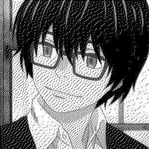

# Dithering

A simple tool to dither an RGBA image.

Inspired by this article: https://beyondloom.com/blog/dither.html

## Supported Algorithms
- [Floyd-Steingberg](https://en.wikipedia.org/wiki/Floyd-Steinberg_dithering)
- [Atkinson](https://en.wikipedia.org/wiki/Atkinson_dithering)

## Usage

```bash
$ ./dithering ./rei.jpeg
```
Creates one file for each algorithm inside the out/ folder
```
out
├── rei.jpeg.atkinson.jpeg
└── rei.jpeg.floyd.jpeg
```

## Example

<table>
  <tr>
    <td><p>Original</p></td>
    <td></td>
  </tr>
  <tr>
    <td><p>Floyd-Steinberg</p></td>
    <td></td>
  </tr>
  <tr>
    <td><p>Atkinson</p></td>
    <td></td>
  </tr>
</table>